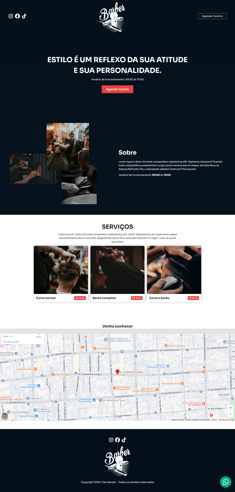

# DevBarber | Dev Éverllon
**DevBarber** é uma landing page simples e intuitivo, ideal para quem quer mostrar seu negócio de forma visual e prática pela web.



## 🛠️ Tecnologias Utilizadas

- Visual Studio Code - para edição do codigo fonte
- **HTML5** + **CSS3 com SASS**
- **JavaScript (ES6)**
- **Font Awesome** – ícones modernos e intuitivos


## 📁 Estrutura do Projeto

```bash
finanControl/
├── index.html
├── style.css
├── style.css.map
├── style.scss
└── README.md
````

##🚀 Como Usar
Faça o clone do projeto:

```bash
git clone https://github.com/deveverllon/ev-barber.git
```
Abra o index.html no seu navegador

### Visualização

👉 Visite a página na web clicando em <a href="https://deveverllon.github.io/dev-barber/" target="_blanck"><strong>Preview</strong></a>

Ou copie o link direto no navegador:  
`https://deveverllon.github.io/dev-barber/`

## 📌 Melhorias Futuras
 - Gráficos dinâmicos por período
 - Exportar dados em CSV
 - Armazenamento local com banco de dados
 - Tema escuro (modo noturno)

## 👨‍💻 Autor
Desenvolvido por Éverllon (DevEverllon)
🔗 deveverllon.github.io

## 📝 Licença
Este projeto está sob a licença MIT. Sinta-se à vontade para usar, modificar e compartilhar!
